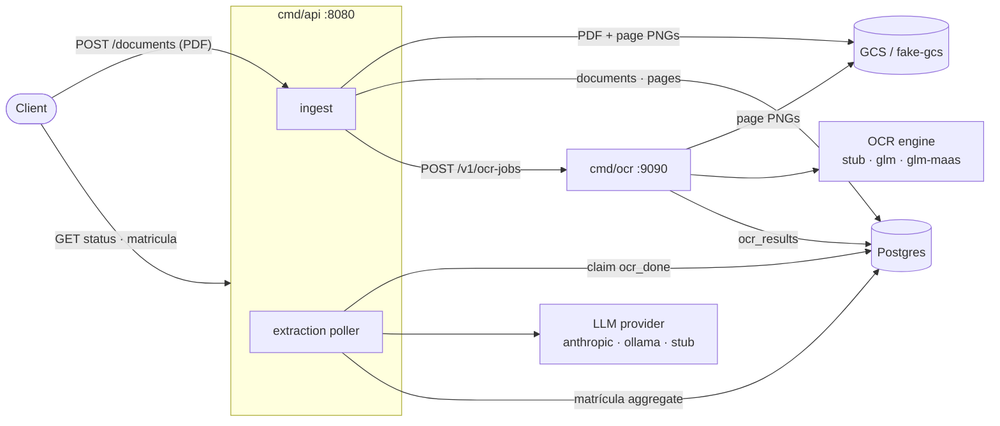

# tax-deeds

**Distressed real estate is a large market in Brazil.** Around half of the adult
population carries overdue debt, much of it tied to property bought with
financing. When a borrower defaults, the lender repossesses the property and
needs to sell it fast — so repossessed units routinely list well below market
price. The catch for a buyer is due diligence: every lien, prior owner, and
registered act lives in the property's **matrícula**, a dense registry document
that is slow and error-prone to read by hand.

`tax-deeds` turns that document into structured, queryable data. You upload a
matrícula PDF; the service runs OCR over its pages, extracts the registry
entities — owners, acts (registros/averbações), and liens (ônus) — with an LLM,
and exposes a read/query API over the result, so a repossessed property can be
vetted in seconds instead of hours.

```
upload → ingest → OCR → LLM extraction → read API
```

## Architecture

Three binaries plus local infra:

| Component | Path | Port | Role |
|-----------|------|------|------|
| API / orchestrator | `cmd/api` | `:8080` | Upload + query endpoints; runs the extraction poller |
| OCR worker | `cmd/ocr` | `:9090` | Transcribes page images (runs inside docker compose) |
| Migrations | `cmd/migrate` | — | Applies goose SQL migrations |

Local infra (via `docker-compose.yml`): **Postgres 17** and
**`fake-gcs-server`** (a Google Cloud Storage emulator for uploaded files).



For the full picture — service-interaction, sequence, and state-machine
diagrams plus a stage-by-stage walkthrough of an analysis — see
**[`docs/ARCHITECTURE.md`](docs/ARCHITECTURE.md)**.

## Prerequisites

- Go 1.26
- Docker + Docker Compose
- `python3` (only used by `scripts/demo.sh` to pretty-print JSON)

## Quick start (offline, no API keys)

The fastest end-to-end run uses the `stub` OCR engine and `stub` LLM provider —
both return fixtures, so no external services or keys are needed.

```bash
cp .env.example .env

make up                     # postgres + fake-gcs + ocr worker (stub engine)
make migrate                # apply DB migrations

make run LLM_PROVIDER=stub  # start the API on :8080
```

Then, in another shell, drive the full pipeline against the bundled sample PDF:

```bash
scripts/demo.sh             # uploads testdata/matricula.pdf, polls, walks the read API
```

The demo uploads a document, waits until its status reaches `extracted`, and
prints the matrícula aggregate plus owners, acts, and liens.

## Configuration

Copy `.env.example` to `.env` and adjust as needed. The Makefile auto-loads
`.env`, and those values **override** prefix-style shell variables
(`LLM_PROVIDER=stub make run` loses to `.env`); to override a `.env` value for
one run, pass it as a make argument: `make run LLM_PROVIDER=stub`. Key
variables:

| Variable | Default | Read by | Purpose |
|----------|---------|---------|---------|
| `PORT` | `8080` | `cmd/api` | HTTP listen port |
| `LOG_LEVEL` | `info` | `cmd/api` | Log verbosity |
| `DATABASE_URL` | *(required)* | api, ocr, migrate | Postgres connection string |
| `GCS_BUCKET` | `matriculas` | `cmd/api` | Object-storage bucket |
| `STORAGE_EMULATOR_HOST` | `localhost:4443` | api, ocr | Point GCS client at fake-gcs (unset in prod) |
| `OCR_SERVICE_URL` | `http://localhost:9090` | `cmd/api` | Where the API dispatches OCR jobs |
| `MAX_UPLOAD_MB` | `25` | `cmd/api` | Upload size limit |
| `MAX_PAGES` | `100` | `cmd/api` | Max pages per document |
| `POLL_INTERVAL` | `5s` | `cmd/api` | Extraction poller interval |
| `STUCK_TIMEOUT` | `10m` | `cmd/api` | Reclaim documents stuck mid-extraction |
| `MAX_EXTRACTION_ATTEMPTS` | `3` | `cmd/api` | Retries before a document is marked failed |

See `.env.example` for the full annotated list.

## Choosing an OCR engine

Set `OCR_ENGINE` (read by `cmd/ocr`). Because the worker runs inside docker
compose, pass the engine when (re)building that service.

- **`stub`** (default) — offline fixture. No setup.
- **`glm-maas`** — GLM-OCR hosted on Zhipu's `layout_parsing` API. Fastest real
  engine: only needs a key.
  - Required: `ZHIPU_API_KEY` (from <https://open.bigmodel.cn>).
  - Optional: `ZHIPU_BASE_URL` (defaults to `https://open.bigmodel.cn/api/paas/v4`).
  - Note: each page image is capped at **10 MB** as a base64 data URI.
  ```bash
  OCR_ENGINE=glm-maas ZHIPU_API_KEY=your-key \
    docker compose up -d --build ocr
  ```
- **`glm`** — any OpenAI-compatible endpoint serving GLM-OCR (Ollama, vLLM,
  SGLang). You host the model yourself.
  - Required: `GLM_BASE_URL`.
  - Optional: `GLM_MODEL` (default `glm-ocr`), `GLM_API_KEY`.

## Choosing an LLM provider

Set `LLM_PROVIDER` / `LLM_MODEL` (read by `cmd/api`). Three providers are
wired in (`internal/clients/llm/extractor.go`):

- **`anthropic`** (default) — requires `ANTHROPIC_API_KEY`;
  `LLM_MODEL=claude-sonnet-5`.
- **`ollama`** — any model served by a local [Ollama](https://ollama.com)
  (no API key). `LLM_MODEL` must match a pulled model exactly as shown by
  `ollama list`, tag included. Optional: `LLM_BASE_URL` (default
  `http://localhost:11434`).
  ```bash
  ollama pull qwen3:8b
  make run LLM_PROVIDER=ollama LLM_MODEL=qwen3:8b
  ```
  Extraction demands strict JSON from Portuguese registry text, so prefer a
  capable instruct model (e.g. `qwen3:8b`, or `qwen3:14b` for better quality).
- **`stub`** — returns fixture extraction output, no key.

Setting `LLM_PROVIDER` to anything else fails at startup. Adding a new provider
means implementing the `Extractor` interface and registering a `case` in the
factory.

## Make targets

| Target | Action |
|--------|--------|
| `make run` | Run the API (`go run ./cmd/api`) |
| `make build` | Build all three binaries into `bin/` |
| `make test` | `go test ./...` |
| `make vet` | `go vet ./...` |
| `make fmt` | `gofmt -w .` |
| `make up` | `docker compose up -d` (postgres + fake-gcs + ocr) |
| `make down` | `docker compose down` |
| `make migrate` | Apply migrations (`goose up`) |
| `make migrate-down` | Roll back the last migration |
| `make migrate-status` | Show migration status |
| `make ocr` | Run the OCR worker on the host |

## API endpoints

| Method & path | Description |
|---------------|-------------|
| `GET /healthz` | Liveness check |
| `GET /readyz` | Readiness check |
| `POST /api/v1/documents` | Upload a matrícula PDF (multipart `file`) |
| `GET /api/v1/documents/{id}` | Document status |
| `GET /api/v1/documents/{id}/ocr` | OCR result for the document |
| `GET /api/v1/documents/{id}/matricula` | Full extracted matrícula aggregate |
| `GET /api/v1/matriculas/{id}/proprietarios` | Owners + cadeia dominial |
| `GET /api/v1/matriculas/{id}/atos?kind=averbacao` | Acts (filter by `kind`) |
| `GET /api/v1/matriculas/{id}/onus?status=ativo` | Liens (filter by `status`) |

## Project layout

- `cmd/` — entrypoints (`api`, `ocr`, `migrate`).
- `internal/` — private implementation: `handlers`, `routes`, `services`,
  `store`, `clients` (`gcs`, `ocr`, `llm`), `ocrengine`, `config`, `dto`.
- `pkg/` — reusable, domain-free utilities (`logger`, `middleware`, `response`).
- `docs/plans/` — the design docs the implementation followed.
