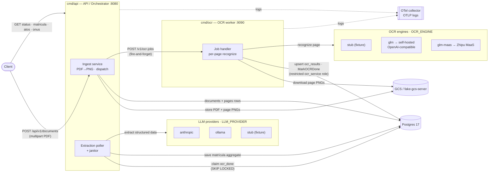
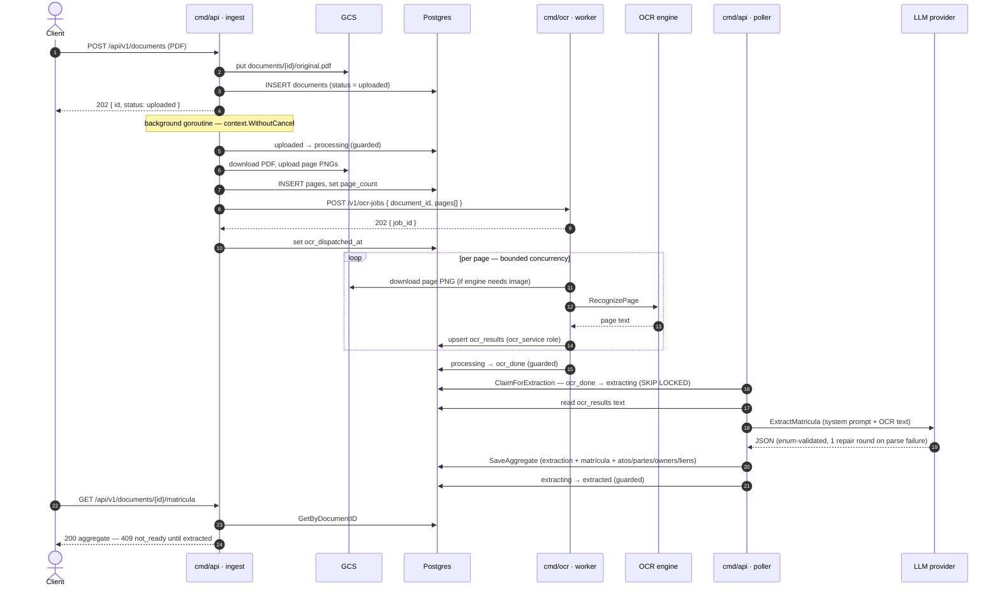
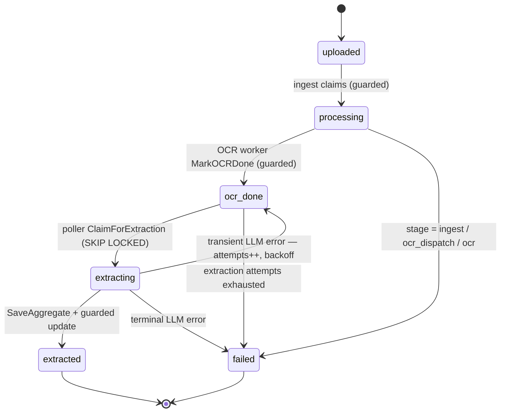
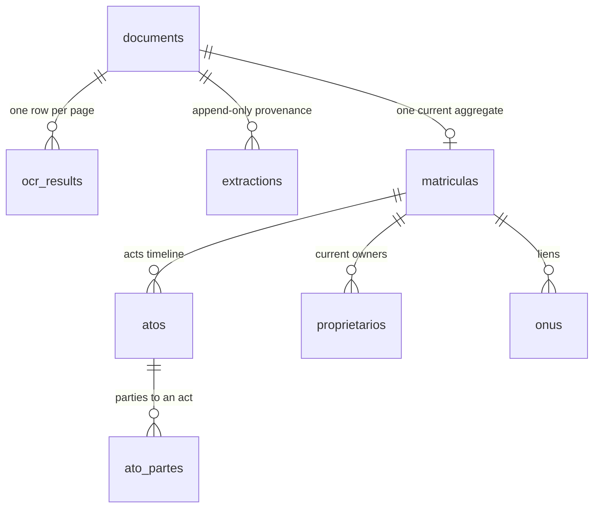

# Architecture & Analysis Flow

This document explains how **tax-deeds** is put together and how a single
document analysis travels through the system end to end. It complements the
[`README.md`](../README.md) (reference material — config, endpoints, make
targets) with the *big picture* and the *why*.

> **What it does.** You upload a Brazilian real-estate registry PDF (a
> *matrícula*). The service renders its pages to images, runs OCR over them,
> asks an LLM to extract structured registry entities (owners, acts, liens) from
> the text, and exposes the result through a read/query API.
>
> ```
> upload → ingest → OCR → LLM extraction → read API
> ```

## Design at a glance

Two long-running binaries plus stateless infrastructure. The defining design
choice is that **there is no message queue** — the pieces are decoupled through
Postgres and one HTTP call:

- **OCR is dispatched fire-and-forget.** The API `POST`s a job to the OCR worker
  and immediately returns; the worker writes results straight back to the shared
  database. Duplicate deliveries are harmless because every write is an
  idempotent upsert.
- **Extraction is pulled, not pushed.** A poller inside the API repeatedly
  *claims* documents whose OCR is done, using `SELECT … FOR UPDATE SKIP LOCKED`
  so any number of API replicas can run the poller without stepping on each
  other.
- **Every state transition is a guarded update** (`… WHERE id = $1 AND status =
  $2`). A crashed or duplicated worker can never corrupt state, and a background
  **janitor** re-drives anything that got stuck.

| Component | Path | Port | Role |
|-----------|------|------|------|
| API / orchestrator | `cmd/api` | `:8080` | Upload + read endpoints, ingest pipeline, extraction poller & janitor |
| OCR worker | `cmd/ocr` | `:9090` | Transcribes page images; writes OCR text back to Postgres |
| Migrations | `cmd/migrate` | — | Applies embedded goose SQL migrations |

Local infrastructure (`docker-compose.yml`): **Postgres 17** and
**`fake-gcs-server`** (a Google Cloud Storage emulator). The OCR worker runs
inside compose; the API and migrations run on the host.

## How the services interact



Both the OCR engine and the LLM provider are **strategy interfaces** selected by
env var, so real models are swappable without touching the pipeline:

- **OCR engines** (`OCR_ENGINE`, in `internal/ocrengine/`): `stub` (offline
  fixture), `glm` (any OpenAI-compatible `/v1/chat/completions` endpoint serving
  GLM-OCR — vLLM/SGLang/Ollama), `glm-maas` (Zhipu's hosted `layout_parsing`
  API).
- **LLM providers** (`LLM_PROVIDER`, in `internal/clients/llm/`): `anthropic`
  (default, Claude), `ollama` (local), `stub`. All go through
  `tmc/langchaingo`.

The `stub` engine + `stub` provider let the entire pipeline run end-to-end
offline with no keys or external services.

## The analysis flow (happy path)



### Stage by stage (with code paths)

1. **Upload & ingest.** `POST /api/v1/documents` is handled in
   `internal/handlers/documents.go` — it enforces the upload size limit
   (`http.MaxBytesReader`), sniffs the `%PDF-` magic bytes (415 on mismatch), and
   calls `ingest.Service.CreateAndProcess`
   (`internal/services/ingest/ingest.go`). That stores the raw PDF at
   `documents/{id}/original.pdf` in GCS, inserts the `documents` row as
   `uploaded`, returns **202**, and continues in a background goroutine started
   with `context.WithoutCancel` so the work survives the request closing.
   `process` transitions `uploaded → processing`, renders pages with the Poppler
   converter (`internal/services/pdfconvert`, shelling out to `pdftoppm -png -r
   200`, page-capped and timeout-bounded), uploads each page PNG, records `pages`
   rows, and dispatches the OCR job.

2. **OCR dispatch & recognition.** `internal/clients/ocr/ocr.go` POSTs the job to
   `{OCR_SERVICE_URL}/v1/ocr-jobs` with retries and exponential backoff. The
   worker (`cmd/ocr/worker.go`) replies **202** immediately, then recognizes
   pages with bounded concurrency (`OCR_PAGE_CONCURRENCY`); the first error
   cancels the rest. Each engine (`internal/ocrengine/`) turns a page image into
   text, and results are written via the **restricted `ocr_service` DB role**
   (`cmd/ocr/store.go`): `UpsertPage` (`ON CONFLICT DO UPDATE`), then a guarded
   `MarkOCRDone` (`processing → ocr_done`). The contract is spelled out in
   [`docs/ocr-contract.md`](./ocr-contract.md).

3. **Extraction.** The poller (`internal/services/extraction/poller.go`) claims
   `ocr_done` documents with `ClaimForExtraction`
   (`internal/store/documents.go`, `FOR UPDATE SKIP LOCKED`), concatenates the
   per-page OCR text, and calls `Extractor.ExtractMatricula`
   (`internal/clients/llm/`). The LLM is prompted (Portuguese system prompt,
   `prompt.go`, `PromptVersion = "v1"`) to emit exactly the
   `dto.ExtractedMatricula` JSON shape. The response is **enum-validated** against
   the closed vocabularies enforced by DB `CHECK` constraints (`atos.kind`,
   `ato_partes.papel`, `tipo_pessoa`, `onus.status`); a parse or enum failure
   triggers **one in-call repair round** that feeds the model its own bad output
   plus the decode error. `normalize.go` then canonicalizes dates (ISO),
   CPF/CNPJ (digits + checksum *flag*, never rejected), currency, and enum
   casing. `SaveAggregate` (`internal/store/matriculas.go`) persists an
   append-only `extractions` provenance row plus the replaced matrícula
   aggregate in one transaction, and the doc moves `extracting → extracted`.

4. **Read / query.** Reads are served from `internal/handlers/matriculas.go` over
   `internal/services/matriculas/matriculas.go`. `GET
   /documents/{id}/matricula` returns the full nested aggregate once `extracted`
   (via `store.Matriculas.GetByDocumentID`); until then it returns **409
   `not_ready`**, and **409 `failed`** if extraction failed. Focused views —
   `/matriculas/{id}/proprietarios` (owners + derived *cadeia dominial*),
   `/atos?kind=`, `/onus?status=` — apply their filters over the same aggregate.

## Document state machine

`documents.status` is the backbone of the pipeline. Every transition is a
guarded update, and terminal states (`extracted`, `failed`) are excluded from
the poller's partial index and from the janitor's "stuck" scan.



**Recovery — the janitor** (`internal/services/extraction/poller.go`) re-drives
non-terminal rows that stalled:

- `processing` with **no** `ocr_dispatched_at` → the API died mid-ingest →
  re-run ingest (idempotent: same GCS object names).
- `processing` with a **stale** `ocr_dispatched_at` → the OCR job was lost →
  re-dispatch (up to a cap, then `failed`).
- `extracting` older than `STUCK_TIMEOUT` → the extraction worker died → return
  to `ocr_done` for another attempt.

Transient LLM failures bounce `extracting → ocr_done` with
`extraction_attempts++` and `next_extraction_at = now() + backoff` (30s, 1m, 2m,
… capped at 10m); the poller only claims rows whose backoff has elapsed, and
gives up after `MAX_EXTRACTION_ATTEMPTS`.

## Data model

Migrations live in `internal/store/migrations/` (embedded, applied by
`cmd/migrate`). The domain aggregate is one matrícula per document, with an
append-only trail of every LLM extraction that produced it.



| Table | Purpose |
|-------|---------|
| `documents` | Upload metadata + `status` state machine + retry bookkeeping (`ocr_dispatched_at`, `extraction_attempts`, `next_extraction_at`) |
| `pages` | One row per rendered page image (GCS object key) |
| `ocr_results` | Per-page OCR text + confidence + engine; written **only** by the `ocr_service` role |
| `extractions` | Append-only LLM provenance: model, prompt version, raw response, token counts |
| `matriculas` | The extracted registry header (número, cartório, imóvel …); replaced on re-extraction |
| `atos` | Registros + averbações as a single ordered timeline (`kind` discriminator) |
| `ato_partes` | Parties to each act (`papel`, name, CPF/CNPJ + validity flag, pessoa type) |
| `proprietarios` | Current-owner snapshot (fração, acquiring act) |
| `onus` | Liens (status ativo/cancelado, constituting/cancelling acts) |

## Reliability notes

- **Least privilege at the DB.** The OCR worker connects as a dedicated
  `ocr_service` role granted only `INSERT/UPDATE` on `ocr_results` and a
  column-scoped `UPDATE` of `documents.status/failed_stage/error_message`. The
  contract is enforced by grants, not documentation.
- **Idempotency everywhere.** OCR result writes upsert; status transitions are
  guarded; ingest reuses deterministic GCS object names — so duplicate
  dispatches and janitor re-runs are safe.
- **Replica-safe claiming.** `FOR UPDATE SKIP LOCKED` lets multiple API replicas
  run the poller concurrently without double-processing.
- **Background work is decoupled from the request.** Ingest runs under
  `context.WithoutCancel`; graceful shutdown drains in-flight work via a
  WaitGroup, and anything unfinished is recovered by the janitor.
- **Observability.** Structured `slog` JSON logs are optionally shipped to an
  OTel collector over OTLP (`pkg/logger`, `OTEL_EXPORTER_OTLP_ENDPOINT`).

## Where to look in the code

| Concern | Location |
|---------|----------|
| Entry points | `cmd/api`, `cmd/ocr`, `cmd/migrate` |
| Routes | `internal/routes/routes.go` |
| HTTP handlers | `internal/handlers/` |
| Ingest / PDF→PNG | `internal/services/ingest/`, `internal/services/pdfconvert/` |
| Extraction poller & janitor | `internal/services/extraction/` |
| Read/query logic | `internal/services/matriculas/` |
| Persistence & migrations | `internal/store/`, `internal/store/migrations/` |
| OCR engines | `internal/ocrengine/` |
| External clients (GCS, OCR, LLM) | `internal/clients/` |
| DTOs / JSON schema | `internal/dto/` |
| Reusable utilities | `pkg/logger`, `pkg/middleware`, `pkg/response` |
| Design docs | `docs/plans/`, `docs/ocr-contract.md` |
